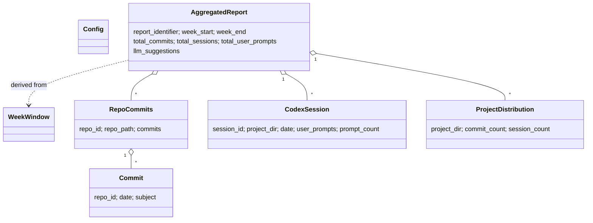

# Design Document

## Overview

「开发周报自动生成」由两个**部署层级（deployment tier）**组成，二者通过一份**摘要化的 JSON 数据契约**解耦：

1. **LOCAL tier（本地层）—— Weekly_Summary_CLI**：一个 Python 命令行工具，运行在开发者本机。它完成**全部**数据采集（`git log` + `~/.codex/sessions/`）、按项目聚合、中文 Markdown 渲染，以及结构化 JSON 导出。原始 Codex 对话记录与源代码**永远不离开本地**。
2. **SERVER tier（服务器层）—— Visualization_Frontend**：一个 Next.js + Tailwind CSS 应用，以 Docker 容器形式部署在用户自有服务器。它**只读取**已经摘要化的 JSON（`dev_log/data/<Report_Identifier>.json`），提供 GitHub OAuth 登录、Allow_List 访问控制与「类似 Apple 官网」审美的周报展示。它**从不**接触原始 Codex 日志或 git 仓库。

两层之间唯一的数据流是 **HANDOFF（数据交接）**：仅把摘要化的 JSON 从本地同步到服务器。**默认机制为 rsync over SSH**（经 `summarize.py --push` 触发），另支持 git pull 与认证上传作为备选。

### 核心设计原则：隐私与数据边界（Privacy / Data Boundary）

这是本设计的**第一性约束**，贯穿所有组件：

- **采集与摘要只在本地发生**：原始 git diff、源代码、Codex 原始对话内容（`input_text` 全文、assistant 回复、推理过程）只存在于 LOCAL tier 的内存与本地文件中。
- **只有摘要化数据跨越边界**：能够到达 SERVER tier 的，仅限于项目名、commit 标题（subject）、主题关键词、各类计数（commit 数 / 会话数 / User_Prompt 数）与可选的 LLM 建议文本。原始 transcript 留在本地。
- **LLM 调用默认关闭**（Req 8.2）；即使开启，LLM_Narrator 也只发送摘要化结构化要点，绝不发送原始对话（Req 8.5、8.6）。
- **网络暴露面必须有认证**：SERVER tier 暴露在网络上，因此强制要求 GitHub OAuth 登录 + Allow_List（Req 12）。缺少认证将导致周报数据公开可访问。
- **凭证不入库**：所有密钥（OAuth client secret、飞书 webhook URL、LLM API key）通过环境变量或本地配置提供，绝不提交进仓库。

> 这一边界既是隐私保证，也是部署架构的硬性切分依据：因为 `~/.codex/sessions/` 与 git 仓库只存在于本地，而前端托管在远程服务器，所以采集逻辑必须全部落在 LOCAL tier，前端只能消费摘要 JSON。

## Architecture

### 两层架构与数据交接流

```mermaid
flowchart TB
    subgraph LOCAL["LOCAL tier 本地机器（隐私边界内）"]
        direction TB
        GIT[("Git 仓库\n(多个本地仓库)")]
        CODEX[("~/.codex/sessions/\nrollout-*.jsonl")]
        CFG[("~/.config/\nweekly-summary.toml")]

        subgraph CLI["Weekly_Summary_CLI (Python)"]
            CL[Config_Loader]
            WW[Week_Window]
            GC[Git_Collector]
            CC[Codex_Collector]
            RA[Report_Aggregator]
            MR[Markdown_Renderer]
            DE[Data_Exporter]
            LN[LLM_Narrator\n(可选, 默认关)]
            FI[Feishu_Integration\n(可选)]
            ORCH[summarize.py\n编排层]
        end

        MD[("dev_log/<id>.md\n本地归档")]
        JSON[("dev_log/data/<id>.json\nStructured_Export = 数据契约")]
    end

    subgraph EXT["外部服务（仅在显式开启时）"]
        LLMAPI["LLM API"]
        FEISHU["飞书 incoming webhook"]
    end

    subgraph SERVER["SERVER tier 自有服务器（网络暴露）"]
        direction TB
        VOL[("挂载数据卷\n/data/*.json")]
        subgraph NEXT["Visualization_Frontend (Next.js + Docker)"]
            AUTH[Auth_Service\nGitHub OAuth + Allow_List]
            READER[Data Reader\n服务端文件读取]
            UI[Dashboard UI\nApple 审美 + 周切换]
        end
        GH["GitHub OAuth"]
    end

    CFG --> CL
    GIT --> GC
    CODEX --> CC
    CL --> ORCH
    WW --> ORCH
    GC --> RA
    CC --> RA
    RA --> MR
    RA --> DE
    RA -. 摘要要点 .-> LN
    LN -. 仅摘要 .-> LLMAPI
    LN --> MR
    MR --> MD
    DE --> JSON
    MR -. 可选推送 .-> FI
    FI -. 单向 .-> FEISHU

    JSON ==>|"HANDOFF: rsync over SSH (默认, --push)\n仅摘要 JSON 跨越边界"| VOL
    VOL --> READER
    AUTH <--> GH
    READER --> UI
    AUTH --> UI

    classDef privacy fill:#fde,stroke:#c39
    classDef server fill:#def,stroke:#39c
    class LOCAL,CLI privacy
    class SERVER,NEXT server
```

### 数据交接（HANDOFF）：默认 rsync over SSH

只有 `dev_log/data/<Report_Identifier>.json` 需要跨越边界（原始 transcript 与源代码绝不跨越）。同步机制的**默认选择是 rsync over SSH**，并由 CLI 的 `summarize.py --push` 开关触发：当配置提供了远端目标 `push_target`（形如 `user@server:/srv/weekly/data/`）时，执行

```bash
rsync -az --delete-after dev_log/data/ "$push_target"
```

仅同步 JSON 数据目录到服务器挂载点；容器从该挂载点只读消费（Req 15.2、15.3）。

选择 rsync over SSH 作为默认的理由：服务器侧**无需额外开放写接口**、传输天然经 SSH 加密、增量同步高效、对个人服务器最省心。

> **SSH 连通性：已就绪的部署前置条件。** 本地机器与服务器之间的 SSH 连接已经建立（基于密钥的 SSH 互信已配置完成，两台机器此前已连过）。因此 rsync over SSH **无需任何额外的密钥配置或首次握手**——这一前置条件已满足。用户要启用数据交接，只需：(1) 在配置中设置 `push_target`（形如 `user@server:/srv/weekly/data/`）；(2) 运行 `summarize.py --push`。rsync 会直接复用现有的 SSH 密钥互信完成同步。

文档同时记录两种**备选**机制（非默认，按需选用）：

| 机制 | 状态 | 机制说明 | 服务器侧读取 |
| --- | --- | --- | --- |
| **rsync over SSH** | **默认** | 本地 `summarize.py --push` → `rsync -az dev_log/data/ user@server:/srv/weekly/data/` | 容器挂载 `/srv/weekly/data/` 为只读数据卷 |
| git pull | 备选 | 把 `dev_log/data/` 纳入一个**私有**仓库，服务器侧定时 `git pull`（cron / webhook） | 容器挂载该仓库的 `dev_log/data/` 子目录为数据卷 |
| 认证上传 | 备选 | CLI 经 HTTPS 把 JSON POST 到前端的受保护上传端点 | 前端写入数据目录后自读（引入服务端写路径，复杂度更高） |

三种方式下，SERVER tier 都只看到摘要 JSON 文件，前端通过扫描挂载目录发现可用周次（Req 13.3、15.2、15.3）。

### 关键架构决策与理由

| 决策 | 选择 | 理由 |
| --- | --- | --- |
| 采集放在哪一层 | 全部放 LOCAL tier | 数据源（codex 日志、git 仓库）只在本地存在；强制隐私边界 |
| 跨层数据格式 | 摘要化 JSON（非 Markdown） | 前端无需解析 Markdown（Req 13.1）；JSON 是稳定的机器契约 |
| 前端认证 | Auth.js (NextAuth v5) + GitHub provider | 标准授权码流程、服务端会话、社区成熟；避免自研令牌交换的安全风险 |
| 容器镜像 | Next.js `output: "standalone"` 多阶段构建 | 最小化镜像，仅含运行所需文件 |
| LLM 默认状态 | 关闭 | 隐私优先（Req 8.2） |

## Components and Interfaces

本节自上而下描述 LOCAL tier（CLI）与 SERVER tier（前端）的各组件、职责与接口签名。Python 侧采用类型注解 + `dataclass`；TypeScript 侧给出关键类型与路由。

### LOCAL tier — Weekly_Summary_CLI

代码组织（建议）：

```
tools/weekly_summary/
├── summarize.py          # CLI 入口 / 编排层
├── config.py             # Config_Loader
├── week_window.py        # Week_Window 逻辑
├── collectors/
│   ├── git_collector.py  # Git_Collector
│   └── codex_collector.py# Codex_Collector
├── aggregate.py          # Report_Aggregator
├── render.py             # Markdown_Renderer
├── export.py             # Data_Exporter（JSON 序列化/反序列化）
├── llm.py                # LLM_Narrator（可选）
├── feishu.py             # Feishu_Integration（可选）
├── models.py             # 数据模型（dataclasses）
├── templates/
│   └── weekly-summary.toml  # 默认配置模板
└── tests/                # 单元测试 + 属性测试 + fixtures
```

#### Config_Loader（`config.py`）— Req 1

职责：读取并解析 `~/.config/weekly-summary.toml`，产出强类型配置对象。

```python
@dataclass(frozen=True)
class LLMConfig:
    enabled: bool = False          # Req 8.2 默认关闭
    provider: str = "openai"       # e.g. "openai" | "anthropic"
    model: str = "gpt-4o-mini"
    # API key 不写入 TOML，从环境变量读取（见 LLM_Narrator）

@dataclass(frozen=True)
class FeishuConfig:
    enabled: bool = False
    webhook_url: str = ""          # 视为机密；可由环境变量覆盖

@dataclass(frozen=True)
class Config:
    repos: list[str]               # 仓库绝对路径列表
    output_dir: str = "dev_log"    # Req 1.5
    author: str | None = None      # 作者过滤（Req 2.4）
    export_enabled: bool = True     # Req 10
    push_target: str | None = None  # rsync over SSH 目标, e.g. "user@host:/srv/weekly/data/"
    llm: LLMConfig = LLMConfig()
    feishu: FeishuConfig = FeishuConfig()

DEFAULT_CONFIG_PATH = Path.home() / ".config" / "weekly-summary.toml"

def load_config(path: Path | None = None) -> Config: ...
#   path=None -> DEFAULT_CONFIG_PATH (Req 1.1)
#   文件缺失 -> ConfigMissingError(含绝对路径) (Req 1.3)
#   TOML 语法非法 -> ConfigParseError(含行号/键名) (Req 1.4)
```

**TOML schema**（默认模板 `templates/weekly-summary.toml`，Req 1.6）：

```toml
# ~/.config/weekly-summary.toml

# 要扫描的 Git 仓库绝对路径列表
repos = [
    "/Users/me/Projects/project-a",
    "/Users/me/Projects/project-b",
]

# 周报输出目录（Markdown 与 data/ 均落于此）
output_dir = "dev_log"

# 仅采集该作者的提交；留空或省略表示不过滤
author = "me@example.com"

# 是否导出结构化 JSON（供前端消费）
export_enabled = true

# 数据交接：rsync over SSH 的远端目标（默认同步机制，配合 `--push`）
# 留空表示不推送；仅同步 dev_log/data/ 下的摘要 JSON
push_target = "user@server:/srv/weekly/data/"

[llm]
enabled = false            # 默认关闭（隐私优先）
provider = "openai"
model = "gpt-4o-mini"
# API key 通过环境变量提供：WEEKLY_SUMMARY_LLM_API_KEY

[feishu]
enabled = false
# webhook_url 建议通过环境变量 WEEKLY_SUMMARY_FEISHU_WEBHOOK 提供（视为机密）
webhook_url = ""
```

#### Week_Window（`week_window.py`）— Req 4

职责：界定本周时间窗并计算 Report_Identifier。

```python
@dataclass(frozen=True)
class WeekWindow:
    start: datetime   # 本地时区, 周一 00:00:00
    end: datetime     # 默认 = now；指定周时 = 周日 23:59:59
    report_identifier: str  # "<ISO-year>-W<ISO-week, 两位补零>", e.g. "2026-W22"

def current_week_window(now: datetime | None = None) -> WeekWindow: ...
#   start = 本周一 00:00:00 本地时区, end = now (Req 4.1)

def week_window_for(year: int, iso_week: int) -> WeekWindow: ...
#   指定周: 周一 00:00:00 -> 周日 23:59:59 (Req 4.2)

def report_identifier(d: date) -> str: ...
#   依据 ISO 8601 周计算 (Req 4.3)；注意 ISO year 可能与日历年不同
```

#### Git_Collector（`collectors/git_collector.py`）— Req 2

职责：对每个仓库运行时间窗内的 `git log`，解析提交记录。

```python
@dataclass(frozen=True)
class Commit:
    repo_id: str        # 仓库标识（取 basename 或配置别名）
    date: date          # 提交日期（本地时区）
    subject: str        # 提交标题

@dataclass(frozen=True)
class RepoCommits:
    repo_id: str
    repo_path: str
    commits: list[Commit]    # 时间窗内（可能为空, Req 2.5）

def collect_commits(repos: list[str], window: WeekWindow,
                    author: str | None) -> tuple[list[RepoCommits], list[Warning]]: ...
```

实现要点：
- 使用 `git -C <repo> log --since=<start> --until=<end> --pretty=format:%H%x1f%ad%x1f%s --date=short`（`%x1f` 为单元分隔符，避免 subject 中的字符冲突）。
- author 过滤通过 `--author=<author>`（Req 2.4）。
- 非 git 路径：捕获 `git` 非零退出 / `fatal: not a git repository`，产出一条标识该路径的 `Warning`，继续处理其余仓库（Req 2.3）。
- 空结果返回空 `commits` 列表，不报错（Req 2.5）。

#### Codex_Collector（`collectors/codex_collector.py`）— Req 3

职责：遍历 `~/.codex/sessions/<YYYY>/<MM>/<DD>/rollout-*.jsonl`，逐行解析 JSONL，提取真实 User_Prompt 并归属到项目/日期。

```python
@dataclass(frozen=True)
class CodexSession:
    session_id: str          # 取自文件名 uuid
    project_dir: str         # 来自首行 session_meta payload.cwd
    date: date               # 来自 payload.timestamp
    user_prompts: list[str]  # 真实 User_Prompt 文本（已排除注入上下文）
    prompt_count: int        # == len(user_prompts) (Req 3.7)

CODEX_SESSIONS_ROOT = Path.home() / ".codex" / "sessions"

def collect_sessions(window: WeekWindow,
                     root: Path = CODEX_SESSIONS_ROOT
                     ) -> tuple[list[CodexSession], list[Warning]]: ...
#   root 不存在 -> 返回空集合 + 一条信息 (Req 3.6)
#   单文件解析失败 -> 跳过 + 警告 + 继续 (Req 3.5)
```

**JSONL 解析规则**：
- 逐行 `json.loads`；每行含顶层 `type` ∈ {`session_meta`, `turn_context`, `event_msg`, `response_item`}。
- 首行 `type == "session_meta"`：从 `payload.cwd` 读 `project_dir`，从 `payload.timestamp` 读会话时间 → `date`（Req 3.2）。
- User_Prompt 选取规则（Req 3.3）：行满足 `type == "response_item"` 且 `payload.type == "message"` 且 `payload.role == "user"`，且其 `payload.content` 含 `type == "input_text"` 的条目，取其 `text`。

**Injected_Context_Message 检测规则**（Req 3.4）—— 关键：

一条候选 user 消息若其拼接后的 `input_text` 文本（去除前导空白后）**以下列任一注入标签开头**，则判定为 Injected_Context_Message 并排除：

```python
INJECTED_TAGS = (
    "<environment_context>",
    "<collaboration_mode>",
    "<skills_instructions>",
    "<plugins_instructions>",
    "<user_instructions>",   # 兼容其它系统注入包装（前缀匹配）
)

def is_injected(text: str) -> bool:
    stripped = text.lstrip()
    return stripped.startswith(INJECTED_TAGS)
```

规则采用**前缀匹配**（`lstrip()` 后判断开头），而非任意位置包含，以避免误伤正文中偶然提到这些标签名的真实提问。被判定为注入的消息既不计入 `prompt_count` 也不进入 `user_prompts`（Req 3.4、3.7）。

#### Report_Aggregator（`aggregate.py`）— Req 5

职责：把 commits 与 sessions 按项目目录聚合、统计、排序。

```python
@dataclass(frozen=True)
class ProjectDistribution:
    project_dir: str
    commit_count: int
    session_count: int

@dataclass(frozen=True)
class AggregatedReport:
    report_identifier: str
    week_start: date
    week_end: date
    distribution: list[ProjectDistribution]      # 含零活动项目, 已排序 (Req 5.1, 5.3)
    repo_commits: list[RepoCommits]              # 各仓库 commit 列表
    repo_sessions: list[CodexSession]            # 各项目 codex 会话
    total_commits: int
    total_sessions: int
    total_user_prompts: int
    llm_suggestions: str | None = None           # 仅当 LLM 开启

def aggregate(config: Config, window: WeekWindow,
              repo_commits: list[RepoCommits],
              sessions: list[CodexSession]) -> AggregatedReport: ...
```

要点：
- 为配置中**每个**项目目录建立 distribution 条目，包含 commit/session 均为零的项目（Req 5.1）。
- **项目归属逻辑**（让 commit 与 codex 会话落入同一组项目桶）：
  - Git 提交天然属于其所在仓库 `path`，直接映射到对应桶。
  - Codex 会话的 `session_meta.payload.cwd` 与每个配置仓库 `path` 做路径归一化后的**最长前缀匹配**（`cwd == path` 或 `cwd` 位于 `path` 子树下）；命中多个时取最长匹配前缀（most-specific）。
  - `cwd` 未匹配任何配置仓库的会话，归入保留桶 `__unmatched__`（展示名「未归类」），保证统计不丢失且不污染配置项目分布。
- 排序键：按 `(commit_count, session_count)` 降序（Req 5.3）。

#### Markdown_Renderer（`render.py`）— Req 6、7

职责：把 `AggregatedReport` 渲染成中文 Markdown。

```python
def render_markdown(report: AggregatedReport) -> str: ...
```

固定章节（标题含 Report_Identifier 与起止日期，Req 6.1）：
1. `# 开发周报 <id>（YYYY-MM-DD ~ YYYY-MM-DD）`
2. `## 时间分布（按项目目录聚合）` — 逐项列 Codex 会话数与 commit 数（Req 6.2）
3. `## 本周做了什么（commit）` — 按仓库分组，列带日期的 subject（Req 6.3）
4. `## 我提了什么关键问题（codex）` — 按仓库分组，列主题与关键问题（Req 6.4）
5. `## 数字` — commit 总数 / Codex 会话总数 / User_Prompt 总数（Req 6.5）
6. `## 自动建议（可选，LLM）` — **仅当** `report.llm_suggestions is not None` 时渲染（Req 6.6、6.7）

#### Data_Exporter（`export.py`）— Req 10（**跨层数据契约**）

职责：把 `AggregatedReport` 序列化为 JSON 写入 `dev_log/data/<Report_Identifier>.json`，并支持反序列化（round-trip）。详细 schema 见 [Data Models](#data-models)。

```python
def to_dict(report: AggregatedReport) -> dict: ...
def from_dict(data: dict) -> AggregatedReport: ...   # 非法内容 -> ExportFormatError (Req 10.5)

def export_json(report: AggregatedReport, output_dir: Path) -> Path: ...
#   目录不存在则创建 (Req 10.2)；返回写入路径
```

#### LLM_Narrator（`llm.py`）— Req 8、9（可选，默认关闭）

职责：在显式开启时，基于**摘要化结构化要点**生成主题归纳与下周建议。

```python
@dataclass(frozen=True)
class LLMInput:
    # 仅摘要要点：项目名 + 主题关键词 + commit 标题。绝无原始对话 (Req 8.5, 8.6)
    project_names: list[str]
    topic_keywords: list[str]
    commit_subjects: list[str]

def build_llm_input(report: AggregatedReport) -> LLMInput: ...
def narrate(llm_input: LLMInput, cfg: LLMConfig,
            api_key: str | None) -> str | None: ...
#   缺凭证 -> 返回 None + 上层产出错误信息, 不含 LLM 章节 (Req 9.3)
#   调用失败 -> 返回 None + 记录失败, 继续生成 (Req 9.2)
```

边界保证：`build_llm_input` 是**唯一**构造外发数据的函数，其输入类型 `LLMInput` 在结构上就排除了原始 transcript（`user_prompts` 全文不在其中），从类型层面强制 Req 8.6。API key 仅从环境变量 `WEEKLY_SUMMARY_LLM_API_KEY` 读取。

#### Feishu_Integration（`feishu.py`）— Req 14（可选）

职责：在显式开启时，周报生成完成后向自定义机器人 incoming webhook 做一次单向推送。

```python
def push_to_feishu(markdown: str, webhook_url: str) -> PushResult: ...
#   失败 -> 记录原因, 不影响本地周报 (Req 14.2, 14.3)
```

要点：与本地报告生成**完全解耦**——无论推送成功/失败/关闭，本地 `.md` 与 `.json` 的产出都不受影响（Req 14.3）。关闭时不发起任何请求（Req 14.4）。webhook URL 视为机密。

#### summarize.py（编排层 / CLI 入口）— Req 11、7

职责：串联整个流程并管理退出码与覆盖确认。

```python
def main(argv: list[str]) -> int: ...
```

默认流程（无参数，Req 11.1）：
`load_config` → `current_week_window` → `collect_commits` + `collect_sessions` → `aggregate` →（可选 `narrate`）→ `render_markdown` → 写 `dev_log/<id>.md` →（可选 `export_json`）→（可选 `push_to_feishu`）。

数据交接：当指定 `--push` 且配置含 `push_target` 时，在导出 JSON 之后执行 rsync over SSH，仅同步 `dev_log/data/` 到远端（默认同步机制）。

退出码：成功 `0`（Req 11.2）；不可恢复错误非零并打印原因（Req 11.3）。

覆盖行为（Req 7.3、7.4、7.5）：
- 目标文件不存在 → 直接写（Req 7.4）。
- 已存在且**交互式**（`sys.stdin.isatty()`）→ 展示确认提示，按用户响应决定（Req 7.3）。
- 已存在且**非交互式** → 跳过覆盖、保留原文件、打印「已跳过覆盖」提示（Req 7.5）。
- 成功写入后打印绝对路径（Req 7.6）。

CLI 参数（可选）：`--config <path>`、`--week <YYYY-Www>`、`--output-dir <dir>`、`--push`（按 `push_target` 执行 rsync over SSH 同步）、`--yes`（非交互式强制覆盖）。

### SERVER tier — Visualization_Frontend（Next.js + Tailwind + Docker）

代码组织（建议，App Router）：

```
frontend/
├── app/
│   ├── layout.tsx
│   ├── page.tsx                  # 仪表盘（受保护）：默认最新周
│   ├── week/[id]/page.tsx        # 指定周视图（受保护）
│   ├── login/page.tsx            # 登录页（GitHub 登录入口）
│   ├── api/auth/[...nextauth]/route.ts  # Auth.js 路由（令牌交换/回调）
│   └── unauthorized/page.tsx     # 不在 Allow_List 的提示页
├── lib/
│   ├── auth.ts                   # Auth.js 配置 + Allow_List 校验
│   └── data.ts                   # 服务端读取/扫描 data 目录
├── components/                   # UI 组件（图表、周切换器等）
├── middleware.ts                 # 路由保护
├── next.config.js                # output: "standalone"
├── Dockerfile
└── docker-compose.yml
```

#### Auth_Service（`lib/auth.ts` + `api/auth/[...nextauth]/route.ts`）— Req 12

**选型：采用 Auth.js (NextAuth v5) 的 GitHub provider，而非自研令牌交换。** 理由：授权码流程涉及 state/PKCE、令牌交换、会话 cookie 加密等安全细节，自研易出错；Auth.js 是 Next.js 生态成熟方案，原生支持 App Router 的服务端会话与 middleware 保护（[Auth.js GitHub 配置](https://authjs.dev/guides/configuring-github)）。内容已据许可改写。

```typescript
// lib/auth.ts
import NextAuth from "next-auth";
import GitHub from "next-auth/providers/github";

const allowList = (process.env.ALLOW_LIST ?? "")
  .split(",").map(s => s.trim().toLowerCase()).filter(Boolean);

export const { handlers, auth, signIn, signOut } = NextAuth({
  providers: [GitHub({
    clientId: process.env.GITHUB_CLIENT_ID!,
    clientSecret: process.env.GITHUB_CLIENT_SECRET!,
  })],
  callbacks: {
    // Allow_List 校验：不在名单 -> 拒绝建立会话 (Req 12.3)
    async signIn({ profile }) {
      const login = (profile?.login as string | undefined)?.toLowerCase();
      return !!login && allowList.includes(login);
    },
  },
  pages: { signIn: "/login", error: "/unauthorized" },
});
```

流程映射：
- 未认证访问受保护页 → `middleware.ts` 重定向到 GitHub 授权码流程登录入口（Req 12.1）。
- 成功回调且账户在 Allow_List → 完成令牌交换、建立服务端会话、放行（Req 12.2）。
- 已认证但不在 Allow_List → `signIn` 回调返回 `false`，不建立会话，跳转 `/unauthorized` 显示「该账户无访问权限」（Req 12.3）。
- OAuth 返回错误 / 用户拒绝授权 → 终止登录、显示认证失败提示、保持未认证（Req 12.4）。
- HTTPS：生产部署必须经 TLS（反向代理终止 TLS 或容器内置证书），OAuth 回调 URL 使用 `https://`（Req 12.5）。secrets 全部来自环境变量。

```typescript
// middleware.ts — 保护除登录/认证路由外的所有页面
export { auth as middleware } from "@/lib/auth";
export const config = { matcher: ["/((?!api/auth|login|unauthorized|_next|favicon).*)"] };
```

#### Data Reader（`lib/data.ts`）— Req 13、15

职责：服务端（Server Component / route handler）从挂载的数据目录读取 JSON，并扫描可用周次。

```typescript
const DATA_DIR = process.env.DATA_DIR ?? "/data";

export async function listAvailableWeeks(): Promise<string[]> {
  // 扫描 DATA_DIR 下 *.json -> 返回 Report_Identifier 列表 (Req 13.3, 15.3)
}
export async function loadReport(id: string): Promise<StructuredExport | null> {
  // 读取 <id>.json；不存在返回 null -> UI 显示「该周暂无数据」(Req 13.4)
}
```

要点：
- 只读 JSON，不解析 Markdown（Req 13.1）。
- 每次请求扫描目录 → 新增/更新的周报文件无需重建镜像即可被读取（Req 15.3）。
- 文件读取在服务端进行（Server Component），不向客户端暴露文件系统路径。

#### Dashboard UI — Req 13.2、13.3

- 已认证用户打开仪表盘 → 展示所选周的时间分布、commit、关键问题与汇总数字（Req 13.2）。
- 顶部「周切换器」（week switcher）按 `listAvailableWeeks()` 列出可选周，跳转 `/week/[id]`（Req 13.3）。
- 请求的周无数据 → 显示「该周暂无数据」（Req 13.4）。

#### 视觉方向（Apple 审美）— 设计方向层面，不写最终 CSS

遵循「Claude Design 生成 mockup → 转 Next.js 前端」的工作流：**先产出设计稿 mockup，再据稿实现**。因此本设计只给出方向，不手写最终 CSS：
- **排版（typography）**：大字号、克制字重层级；系统无衬线字体栈（`-apple-system, ...`）；充足行高。
- **留白（whitespace）**：大面积留白、宽松栅格、内容居中、分区清晰。
- **动效（motion）**：低调的滚动渐显与卡片悬浮过渡，避免喧宾夺主。
- **色彩**：浅色为主、克制点缀色用于数据强调。
- Tailwind CSS 作为实现工具；最终样式 token 待 mockup 确定后落地。

## Data Models

本节定义内存数据模型（dataclasses，已在上文给出）与**精确的 Structured_Export JSON schema**——它是 LOCAL tier 与 SERVER tier 之间的契约（Req 10.3），Next.js 前端据此消费。

### Structured_Export JSON schema（`dev_log/data/<Report_Identifier>.json`）

```jsonc
{
  "schema_version": 1,                       // 契约版本，便于前端兼容判断
  "report_identifier": "2026-W22",           // string, Req 4.3
  "week_start": "2026-05-25",                // string, ISO date YYYY-MM-DD
  "week_end": "2026-05-31",                  // string, ISO date YYYY-MM-DD
  "distribution": [                          // 时间分布, 已降序, 含零活动项目 (Req 5)
    {
      "project_dir": "/Users/me/Projects/project-a",
      "project_name": "project-a",           // basename, 前端展示用
      "commit_count": 12,                    // integer >= 0
      "session_count": 4                     // integer >= 0
    }
  ],
  "repo_commits": [                          // 各仓库 commit 列表 (Req 6.3, 10.3)
    {
      "repo_id": "project-a",
      "commits": [
        { "date": "2026-05-26", "subject": "Add login route" }
      ]
    }
  ],
  "repo_codex": [                            // 各仓库 codex 主题/问题 (Req 6.4, 10.3)
    {
      "repo_id": "project-a",
      "session_count": 4,
      "themes": ["auth flow", "oauth callback"],   // 摘要化主题关键词
      "key_questions": [                            // 摘要化关键问题
        "如何在 App Router 下保护路由？"
      ]
    }
  ],
  "numbers": {                               // 汇总数字 (Req 6.5, 10.3)
    "total_commits": 12,
    "total_sessions": 4,
    "total_user_prompts": 37
  },
  "llm_suggestions": null                    // string | null；关闭时为 null (Req 6.6/6.7)
}
```

字段类型契约（前端 TypeScript 镜像）：

```typescript
// frontend/lib/types.ts —— 必须与 Python Data_Exporter 输出保持一致
export interface StructuredExport {
  schema_version: number;
  report_identifier: string;
  week_start: string;   // YYYY-MM-DD
  week_end: string;     // YYYY-MM-DD
  distribution: ProjectDistribution[];
  repo_commits: RepoCommitGroup[];
  repo_codex: RepoCodexGroup[];
  numbers: { total_commits: number; total_sessions: number; total_user_prompts: number };
  llm_suggestions: string | null;
}
export interface ProjectDistribution {
  project_dir: string; project_name: string;
  commit_count: number; session_count: number;
}
export interface RepoCommitGroup {
  repo_id: string;
  commits: { date: string; subject: string }[];
}
export interface RepoCodexGroup {
  repo_id: string; session_count: number;
  themes: string[]; key_questions: string[];
}
```

**契约约束**：
- 字段名与类型固定；新增字段须递增 `schema_version`，前端按版本兼容处理。
- **隐私**：schema 中只含摘要数据——`repo_codex` 仅含 `themes` / `key_questions`（摘要化），**不含** `user_prompts` 全文与任何原始 transcript。这从数据契约层面强制隐私边界：能跨越到 SERVER tier 的只有摘要。
- `from_dict(to_dict(report))` 必须语义等价（Req 10.4，见 Correctness Properties）。

### 数据模型关系图



## Correctness Properties

*属性（property）是指在系统所有合法执行中都应成立的特征或行为——本质上是关于系统应当做什么的形式化陈述。属性在人类可读的规格说明与机器可验证的正确性保证之间架起桥梁。*

下列属性来自对验收标准（acceptance criteria）的可测试性分析（见 prework）。本特性的核心逻辑——JSONL 解析、注入消息排除、时间窗计算、聚合、JSON round-trip、隐私边界、Allow_List 校验——都是纯函数或输入变化显著的逻辑，**适合属性测试（PBT）**。前端 UI 渲染、Docker 打包、OAuth 端到端流程则归入集成/快照测试（见 Testing Strategy）。

经属性反思（property reflection）去冗余后，保留以下 19 条属性。

### Property 1: 配置解析正确性

*For any* 合法的 TOML 配置内容（仓库列表 + 任意可选字段组合），`load_config` 解析出的 `Config` 对象的各字段值应与输入内容一致（repos、output_dir、author、export_enabled、llm/feishu 开关）。

**Validates: Requirements 1.2**

### Property 2: Git 采集落在时间窗内且保留字段

*For any* 一组带随机提交日期的提交记录与一个 Week_Window，`collect_commits` 返回的每条提交的日期都应落在 `[window.start, window.end]` 内，窗内的提交都应被采集，且每条结果都保留 `repo_id`、`date`、`subject` 三个字段且值与源一致。

**Validates: Requirements 2.1, 2.2**

### Property 3: Git 作者过滤

*For any* 一组多作者的随机提交与一个作者过滤条件，`collect_commits` 返回的所有提交的作者都应匹配该过滤条件。

**Validates: Requirements 2.4**

### Property 4: Codex 会话解析正确性

*For any* 一个结构合法的 Codex_Session_Log（随机 `session_meta` 的 `cwd`/`timestamp` 与随机混合行），`collect_sessions` 解析出的会话的 `project_dir` 与 `date` 应分别等于 `payload.cwd` 与 `payload.timestamp`；其 `user_prompts` 应恰好包含所有满足 `type=="response_item"`、`payload.type=="message"`、`payload.role=="user"`、含 `input_text` 且非注入的条目；且 `prompt_count == len(user_prompts)`。

**Validates: Requirements 3.2, 3.3, 3.7**

### Property 5: 注入上下文消息被排除（关键）

*For any* 一条 `role=="user"` 的消息文本，若其去除前导空白后以注入标签（`<environment_context>`、`<collaboration_mode>`、`<skills_instructions>`、`<plugins_instructions>` 等）开头，则该消息既不出现在 `user_prompts` 中也不计入 `prompt_count`；否则（真实提问）应被保留并计数。

**Validates: Requirements 3.4**

### Property 6: Codex 会话文件发现与时间过滤

*For any* 在 `~/.codex/sessions/` 目录树下随机分布的会话文件集合（部分会话时间在窗内、部分在窗外），`collect_sessions` 应恰好读取文件名形如 `rollout-<timestamp>-<uuid>.jsonl` 且会话时间落在 Week_Window 内的文件。

**Validates: Requirements 3.1**

### Property 7: 默认 Week_Window 计算

*For any* 当前时刻 `now`，`current_week_window(now)` 的 `start` 应等于 `now` 所在 ISO 周周一的本地时区 00:00:00，且 `start <= end == now`。

**Validates: Requirements 4.1**

### Property 8: 指定周 Week_Window 计算

*For any* 合法的 `(year, iso_week)`，`week_window_for(year, iso_week)` 的 `start` 应为该周周一 00:00:00、`end` 应为该周周日 23:59:59（本地时区），且窗跨度约为 7 天。

**Validates: Requirements 4.2**

### Property 9: Report_Identifier 的 ISO 计算

*For any* 日期 `d`，`report_identifier(d)` 应形如 `YYYY-Www`（周序号两位补零）且其 year/week 等于 `d` 的 ISO 8601 `isocalendar()` 结果（正确处理跨年周）。

**Validates: Requirements 4.3**

### Property 10: 聚合为每个项目建条目且计数正确

*For any* 一组配置项目目录与任意 commits/sessions 活动，`aggregate` 产出的 `distribution` 的 `project_dir` 集合应等于配置项目集合（含 commit 与 session 均为零的项目），且每个条目的 `commit_count`/`session_count` 应等于输入中归属该项目的实际数量。

**Validates: Requirements 5.1, 5.2**

### Property 11: 聚合排序不变式

*For any* 一组项目分布，`aggregate` 返回的 `distribution` 应按 `(commit_count, session_count)` 降序排列（任意相邻条目满足非升序）。

**Validates: Requirements 5.3**

### Property 12: Markdown 渲染包含性

*For any* `AggregatedReport`，`render_markdown` 产出的文本应包含：标题中的 `report_identifier` 与起止日期（`YYYY-MM-DD`）；「时间分布」章节中每个项目的会话数与 commit 数；「本周做了什么（commit）」章节中每条提交的日期与 subject；「我提了什么关键问题（codex）」章节；以及「数字」章节中的三类总数（commit 总数、Codex 会话总数、User_Prompt 总数）。

**Validates: Requirements 6.1, 6.2, 6.3, 6.4, 6.5**

### Property 13: LLM 建议章节的条件渲染

*For any* `AggregatedReport`，`render_markdown` 产出的文本包含「自动建议（可选，LLM）」章节，当且仅当 `report.llm_suggestions` 非空；无论该章节是否存在，其余固定章节都应正常生成。

**Validates: Requirements 6.6, 6.7**

### Property 14: LLM 关闭时全流程零外发

*For any* 输入数据，当 `llm.enabled == false` 时运行完整生成流程，外部网络层应记录到零次调用（不向任何外部服务发送任何数据）。

**Validates: Requirements 8.1, 8.4**

### Property 15: LLM 配置持久性

*For any* `llm.enabled` 的取值，加载配置并运行流程后，配置中的 `enabled` 值不应被运行时修改或重置（开启保持开启，关闭保持关闭）。

**Validates: Requirements 8.3**

### Property 16: LLM 开启时仅外发摘要且不含原始对话

*For any* 含原始 `user_prompts` 文本的 `AggregatedReport`，当 LLM 开启时，`build_llm_input` 构造的外发负载应仅包含摘要字段（项目名、主题关键词、commit 标题），且不包含任何原始 Codex 对话文本（任一 `user_prompt` 原文都不是外发负载的子串）。

**Validates: Requirements 8.5, 8.6**

### Property 17: JSON 序列化 round-trip 等价

*For any* 合法的 `AggregatedReport`，先 `to_dict` 序列化为 Structured_Export 再 `from_dict` 反序列化，应得到与原对象语义等价的 `AggregatedReport`（所有规定字段——identifier、起止日期、分布、commit 列表、codex 主题、汇总数字——都被完整保留）。

**Validates: Requirements 10.3, 10.4**

### Property 18: 前端 loader 与 CLI 导出契约一致

*For any* 由 CLI `Data_Exporter` 导出的合法 Structured_Export JSON，前端 `loadReport` 解析出的对象应与导出时的结构等价（字段名与类型逐一对应），从而保证跨语言数据契约一致。

**Validates: Requirements 13.1**

### Property 19: Allow_List 校验

*For any* GitHub 登录名 `login` 与 Allow_List 名单，`Auth_Service` 的 `signIn` 回调返回 `true`（建立会话）当且仅当 `login`（不区分大小写）属于该名单；否则拒绝且不建立会话。

**Validates: Requirements 12.3**

## Error Handling

错误处理遵循「**本地采集尽量降级而非中止；可选功能失败不影响核心产出；不可恢复错误显式退出**」的原则。

| 组件 | 失败模式 | 行为 | 需求 |
| --- | --- | --- | --- |
| Config_Loader | 配置文件缺失 | 抛 `ConfigMissingError`，消息含期望绝对路径；CLI 非零退出 | 1.3, 11.3 |
| Config_Loader | TOML 语法非法 | 抛 `ConfigParseError`，消息含行号/键名；CLI 非零退出 | 1.4, 11.3 |
| Git_Collector | 路径非 git 仓库 | 记录警告（标识该路径），跳过并继续其余仓库 | 2.3 |
| Git_Collector | 仓库窗内无提交 | 返回空集合，不报错 | 2.5 |
| Codex_Collector | 单个 JSONL 文件损坏/不可解析 | 跳过该文件，记录警告（标识文件），继续其余 | 3.5 |
| Codex_Collector | `~/.codex/sessions/` 不存在 | 返回空集合，记录目录缺失信息（非错误） | 3.6 |
| Data_Exporter | data 目录不存在 | 创建目录后写入 | 10.2 |
| Data_Exporter | 反序列化遇损坏/缺字段 JSON | 抛 `ExportFormatError`（描述性） | 10.5 |
| LLM_Narrator | 调用外部 LLM 失败 | 记录失败，`llm_suggestions=None`，继续生成无 LLM 章节的周报 | 9.2 |
| LLM_Narrator | 缺少 API 凭证 | 返回缺凭证错误信息，生成无 LLM 章节的周报 | 9.3 |
| Feishu_Integration | webhook 推送失败 | 记录原因，不影响本地 `.md`/`.json` 产出 | 14.2, 14.3 |
| Weekly_Summary_CLI | 目标 `.md` 已存在（交互式） | 展示覆盖确认提示，按响应决定 | 7.3 |
| Weekly_Summary_CLI | 目标 `.md` 已存在（非交互式） | 跳过覆盖、保留原文件、打印「已跳过覆盖」 | 7.5 |
| Weekly_Summary_CLI | 不可恢复错误 | 非零退出码 + 打印错误原因 | 11.3 |
| Auth_Service | 账户不在 Allow_List | 拒绝访问、`/unauthorized` 提示，不建立会话 | 12.3 |
| Auth_Service | OAuth 错误/拒绝授权 | 终止登录、显示失败提示、保持未认证 | 12.4 |
| Visualization_Frontend | 请求周无对应 JSON | 显示「该周暂无数据」 | 13.4 |

## Testing Strategy

采用**双轨测试**：属性测试覆盖通用正确性（输入空间大、逻辑为纯函数的部分），单元/集成/快照测试覆盖具体示例、边界、外部接线与 UI。

### 属性测试（Property-Based Testing）

- **库**：Python 侧使用 **Hypothesis**；前端契约一致性（Property 18）与 Allow_List（Property 19）使用 **fast-check**（TypeScript）。不自行实现 PBT 框架。
- **迭代次数**：每个属性测试至少运行 **100** 次随机迭代（Hypothesis `max_examples>=100`；fast-check `numRuns>=100`）。
- **标注**：每个属性测试以注释标注其对应的设计属性，格式：
  `# Feature: weekly-dev-report, Property {number}: {property_text}`
- **一一对应**：上文 19 条 Correctness Properties 各由**一个**属性测试实现。
- 位置：`tools/weekly_summary/tests/`（Python）、`frontend/__tests__/`（前端）。

属性测试覆盖映射：P1（config 解析）、P2/P3（git 采集与过滤）、P4/P5/P6（codex 解析、注入排除、文件发现）、P7/P8/P9（week window 与 identifier）、P10/P11（聚合与排序）、P12/P13（渲染）、P14/P15/P16（隐私边界与配置持久性）、P17（JSON round-trip，对应 Req 10.4）、P18（跨层契约）、P19（Allow_List）。

> **解析与序列化重点**：Codex JSONL 解析与 JSON 导出是最易出错处。Property 17 的 round-trip、Property 4/5 的解析正确性是优先级最高的属性测试。

### 单元测试（Unit / Example / Edge Case）

聚焦具体示例与边界，避免与属性测试重复：
- Config_Loader：默认路径选择（1.1）、output_dir 使用（1.5）、非法 TOML 样本（1.4）、默认模板检查（1.6/8.2，smoke）。
- Git_Collector：非 git 路径警告（2.3）、空提交（2.5）。
- Codex_Collector：使用**真实 Codex JSONL fixtures**（含 `session_meta` 首行、真实 user 提问、被 `<environment_context>` 等包裹的注入消息）验证解析与**注入排除**；损坏文件跳过（3.5）；目录缺失（3.6）。
- Data_Exporter：落地路径（10.1）、目录创建（10.2）、损坏 JSON 报错（10.5）。
- Markdown 落地：路径（7.1）、目录创建（7.2）、交互覆盖确认（7.3/7.4）、非交互跳过（7.5）、打印绝对路径（7.6）。
- summarize.py：成功退出码（11.2）、不可恢复错误退出码（11.3）。
- LLM_Narrator：调用失败降级（9.2）、缺凭证（9.3）。
- Feishu：关闭时零调用（14.4）、失败不影响本地（14.2）。

### 集成测试（Integration）

- 端到端 CLI（11.1）：用 fixtures 仓库 + codex 日志跑完整流程，断言生成 `.md` 与 `.json`。
- LLM 主题归纳（9.1）：mock LLM 响应断言纳入；可选 1-2 例真实调用。
- 飞书推送（14.1/14.3）：mock webhook，断言开启时推送一次；推送成功/失败/关闭三态下本地产出一致。
- 前端认证（12.1/12.2/12.4）：mock OAuth profile，验证重定向、会话建立、错误处理。
- 容器与挂载（15.2/15.3）：启动容器挂载样例数据卷，验证读取与运行中新增文件可读。

### 前端测试（Component / Snapshot）

- Dashboard 渲染（13.2）：给定 StructuredExport，断言渲染出时间分布、commit、关键问题、数字四区块。
- 周切换器（13.3）：多周数据下断言切换入口出现。
- 无数据提示（13.4）：请求不存在周断言「该周暂无数据」。
- 视觉实现按「mockup → 实现」流程推进，最终样式以快照/视觉回归测试校验（mockup 定稿后）。

### Smoke / 配置检查

- 默认模板 LLM 关闭（1.6, 8.2）。
- HTTPS 与 secure cookie 配置（12.5）。
- Docker 镜像构建成功、Dockerfile/compose 存在（15.1）。
- 前端从 env 读取 OAuth 凭证与 Allow_List（15.4）。

### 设计组件 → 需求映射（追溯）

| 设计组件 | 满足的需求 | 主要属性 |
| --- | --- | --- |
| Config_Loader | 1.1–1.6, 8.2, 8.3 | P1, P15 |
| Git_Collector | 2.1–2.5 | P2, P3 |
| Codex_Collector | 3.1–3.7 | P4, P5, P6 |
| Week_Window / Report_Identifier | 4.1–4.3 | P7, P8, P9 |
| Report_Aggregator | 5.1–5.3 | P10, P11 |
| Markdown_Renderer (render.py) | 6.1–6.7, 7.1–7.6 | P12, P13 |
| Data_Exporter | 10.1–10.5, 13.1 | P17, P18 |
| LLM_Narrator + 隐私边界 | 8.1, 8.4–8.6, 9.1–9.3 | P14, P16 |
| Feishu_Integration | 14.1–14.4 | （集成） |
| summarize.py（编排） | 11.1–11.3 | （集成） |
| Auth_Service / 前端 | 12.1–12.5, 13.1–13.4 | P19 |
| Docker 打包 / 同步桥接 | 15.1–15.4 | （集成 / 冒烟） |

## Deployment & Container Packaging（SERVER tier）— Req 15

### Dockerfile（Next.js standalone 多阶段构建）

采用 Next.js `output: "standalone"`（`next.config.js`）+ 多阶段构建，产出最小镜像（[Next.js 部署文档](https://nextjs.org/docs/app/getting-started/deploying)；内容已据许可改写）。要点：standalone 输出不含 `.next/static` 与 `public`，需在镜像中单独复制。

```dockerfile
# 1) deps
FROM node:20-alpine AS deps
WORKDIR /app
COPY package.json package-lock.json ./
RUN npm ci

# 2) build
FROM node:20-alpine AS builder
WORKDIR /app
COPY --from=deps /app/node_modules ./node_modules
COPY . .
RUN npm run build           # 依赖 next.config.js: output: "standalone"

# 3) runtime
FROM node:20-alpine AS runner
WORKDIR /app
ENV NODE_ENV=production
RUN addgroup -S nodejs && adduser -S nextjs -G nodejs
COPY --from=builder /app/.next/standalone ./
COPY --from=builder /app/.next/static ./.next/static
COPY --from=builder /app/public ./public
USER nextjs
EXPOSE 3000
CMD ["node", "server.js"]
```

### docker-compose（挂载数据卷 + 环境变量）

```yaml
services:
  weekly-frontend:
    build: ./frontend
    ports:
      - "3000:3000"           # 经反向代理（Nginx/Caddy）终止 TLS 对外暴露 HTTPS
    environment:
      - DATA_DIR=/data
      - GITHUB_CLIENT_ID=${GITHUB_CLIENT_ID}
      - GITHUB_CLIENT_SECRET=${GITHUB_CLIENT_SECRET}
      - ALLOW_LIST=${ALLOW_LIST}        # 逗号分隔的 GitHub login 列表
      - AUTH_SECRET=${AUTH_SECRET}      # Auth.js 会话加密密钥
      - AUTH_URL=https://your-domain    # OAuth 回调基址（HTTPS）
    volumes:
      - /srv/weekly/data:/data:ro       # HANDOFF 同步目标目录，只读挂载
    restart: unless-stopped
```

要点：
- 数据卷以**只读**挂载（容器不写数据），新增/更新 JSON 无需重建镜像即可被读取（Req 15.3）。
- 所有 secrets 经环境变量注入，**不**写入镜像或仓库（Req 15.4，安全约束）。
- TLS：容器本身监听 HTTP:3000，由前置反向代理终止 TLS 并对外提供 HTTPS（Req 12.5）；OAuth 回调 URL 配置为 `https://`。

## Security Considerations

- **网络暴露面强制认证**：Visualization_Frontend 暴露在网络上，必须经 GitHub OAuth 登录 + Allow_List 限制（Req 12）。中间件保护除登录/认证路由外的所有页面。缺少认证将导致周报数据（项目名、提交标题、主题）公开可访问。
- **secrets 经 env 注入、不入库**：OAuth client id/secret、`AUTH_SECRET`、`ALLOW_LIST`、LLM API key、飞书 webhook URL 全部通过环境变量或本地配置提供，绝不提交进仓库。飞书 webhook URL 视为机密。
- **只有摘要数据离开本地**：HANDOFF 仅同步摘要化 JSON；原始 Codex transcript、源代码、git diff 永不离开 LOCAL tier。Structured_Export schema 在结构上就排除原始对话（`repo_codex` 只含 `themes`/`key_questions`）。
- **LLM 外发最小化**：LLM 默认关闭；开启时仅经 `build_llm_input` 发送摘要要点（类型层面排除原始 transcript，Property 16）。
- **HTTPS 传输**：登录凭证与 OAuth 回调数据经 TLS 传输（Req 12.5）；会话 cookie 设 `secure`/`httpOnly`。
- **容器最小权限**：镜像以非 root 用户运行，数据卷只读挂载。
